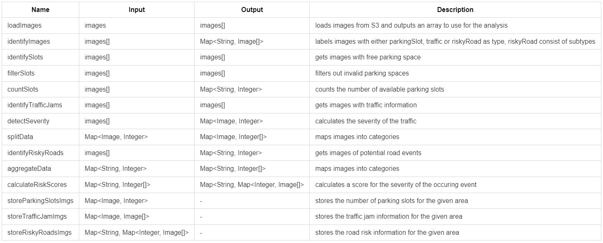
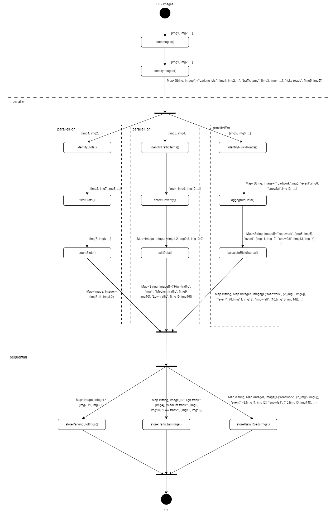

#### Road Analysis System

The system analyses images from roads and calculates parking slot availability, detects traffic jams and special events that can occur.

We start off with loading the images from S3, then we label them to one of our use case in identifyImages. Each use case is executed in parallel and all the images for a use case are executed in a prallelFor construct. The steps are described in our table but here are some key functions described in more detail:

- detectSeverity

We calculate the distances between the cars on the image. For each car the distances to each neighbor is calculated. Then all distances are added and the average is calulcated. The result is normalized to a number between 0 (low traffic) - 10 (high traffic).

- calculateRiskScores

The risk score is calculated by comparing the images with images of different risk scores. These images were identified before from us where we associated them with some score between 0 (low risk) - 10 (high risk). So depending on the similarity of the images from the output of the aggregateData function with the images with predefined risk scores, the risk scores for those images are going to be detected.

To get a stateful application we store the intermediate results in a redis cluster.

At the end we store our results for the specific area we got the pictures from in the S3 bucket.

#### Functions

#### Workflow

